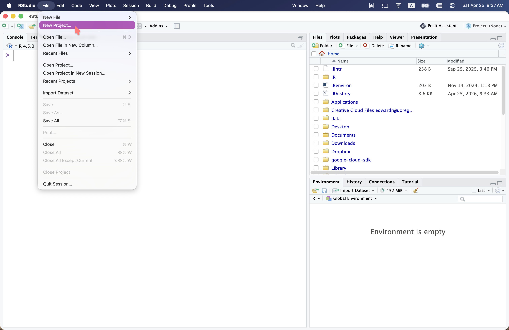
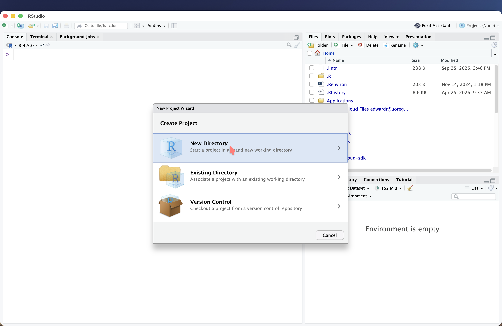
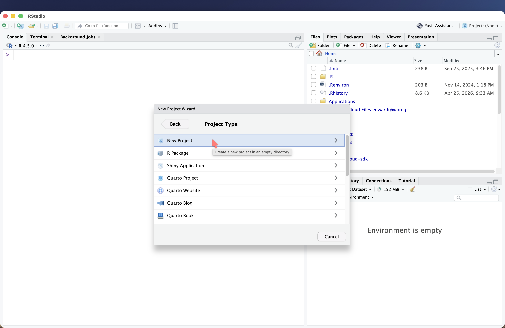
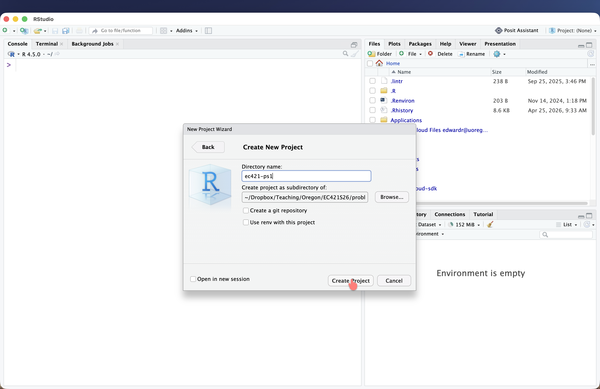
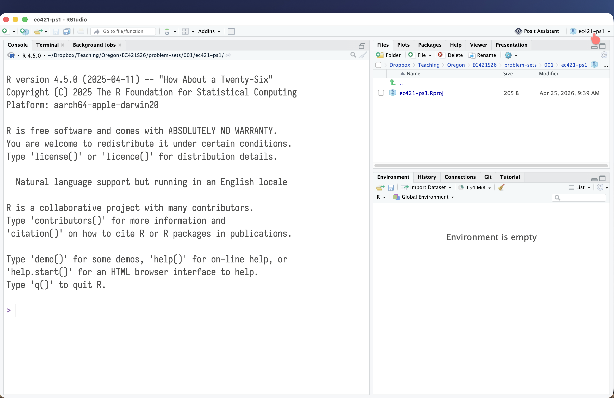
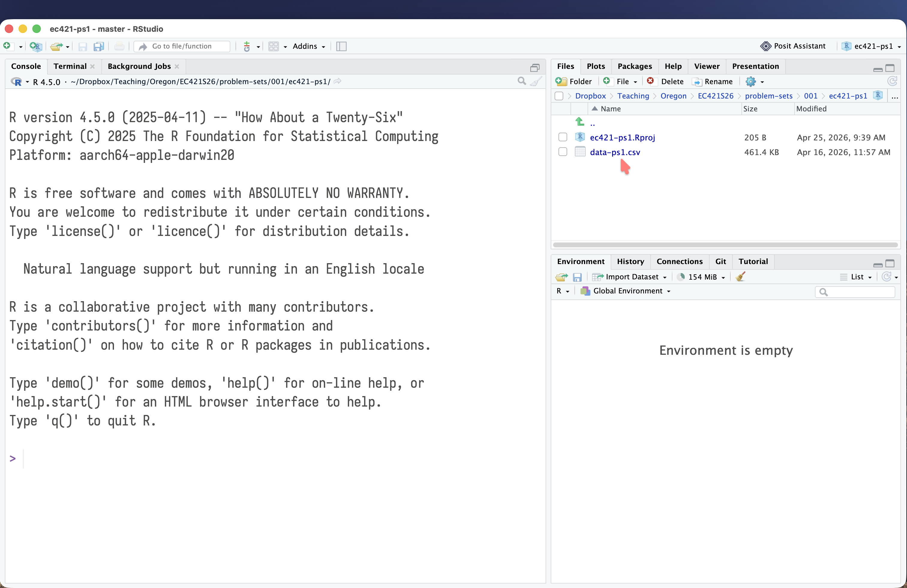
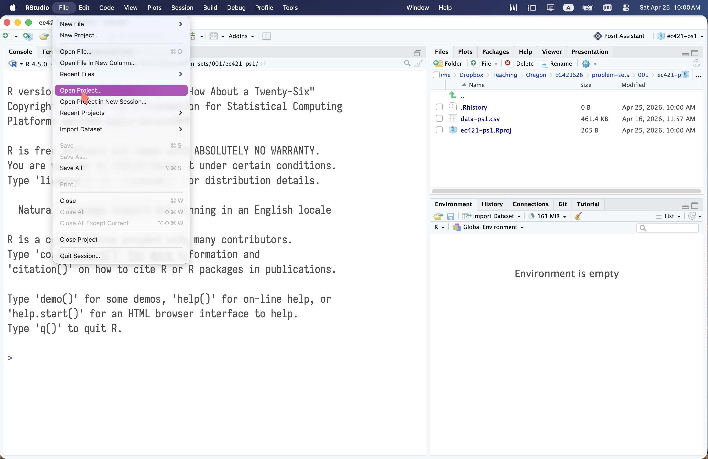
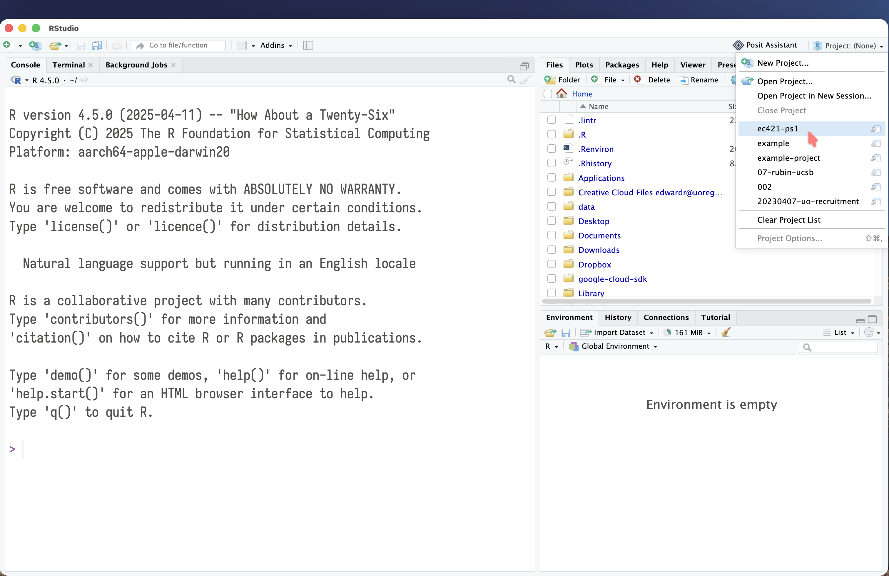

## Projects

Using RStudio projects is a great way to manage your files and keep your work organized.

A project is a folder that contains all the files related to a specific analysis or research project. When you create a project, RStudio will automatically set the working directory to the project folder, which makes it easier to manage your files and avoid confusion.

## Setting up a project

{.lightbox}

{.lightbox}

{.lightbox}

{.lightbox}

{.lightbox}

{.lightbox}

## Accessing projects

To access an existing project, you have two options:

{.lightbox}

{.lightbox}

